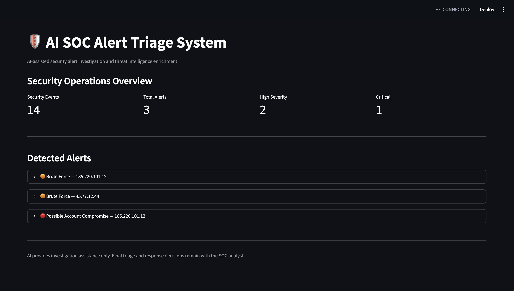

cat > README.md <<'EOF'
# AI SOC Alert Triage System

An AI-assisted Security Operations Center (SOC) alert triage platform that detects suspicious authentication activity, extracts indicators of compromise (IOCs), enriches alerts with threat intelligence, and uses a locally hosted LLM to assist analysts with investigation.
## Dashboard

The Streamlit dashboard provides a SOC analyst view of detected security alerts, IOC extraction, threat intelligence enrichment, and AI-assisted investigation.


## Project Overview

Security analysts often need to investigate large numbers of alerts containing authentication events, suspicious IP addresses, and repeated login failures.

This project demonstrates a lightweight SOC workflow that combines:

- Rule-based security detection
- IOC extraction
- Threat intelligence enrichment
- Local LLM-assisted investigation
- MITRE ATT&CK mapping
- Analyst-focused visualization

The AI is designed as an **analyst-assistance layer**, not an autonomous response system. Final triage and response decisions remain with the SOC analyst.

## Architecture

```text
                    Security Logs
                         |
                         v
                +------------------+
                | Detection Engine |
                +--------+---------+
                         |
                         v
                   Security Alert
                         |
                         v
                +------------------+
                |  IOC Extraction  |
                +--------+---------+
                         |
                         v
                +------------------+
                |   AbuseIPDB API  |
                | Threat Intel     |
                +--------+---------+
                         |
                         v
                +------------------+
                | Local Qwen3 LLM  |
                |     Ollama       |
                +--------+---------+
                         |
                         v
                +------------------+
                |  Streamlit SOC   |
                |    Dashboard     |
                +--------+---------+
                         |
                         v
                   SOC Analyst
git clone <YOUR_GITHUB_REPOSITORY_URL>
cd ai-soc-alert-triage
python3 -m venv venv
source venv/bin/activate
pip install -r requirements.txt
